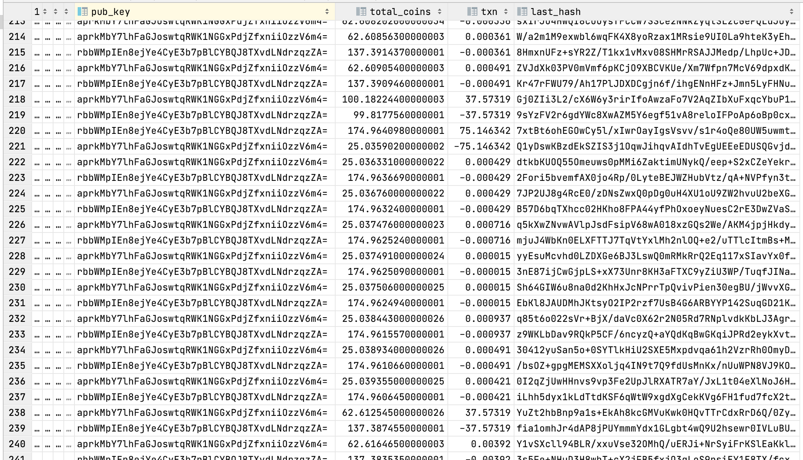

# The blockchain

To guarantee the integrity of the wallet, and its history, lighthouse uses blockchain.

Each time a file is sent, the blockchain is requested to deduct coins from the receiver, and add the same number to the sender. This is logged in a blockchain. The last record containing the hash of the last-to-last record is serialized into a binary format using `msgpack`, and then hashed to a 512-bit long hash using `blake2b`. The hash is stored along with the current amount of coins and the added/deducted amount against the public key of the peer.

### This is how a blockchain looks

